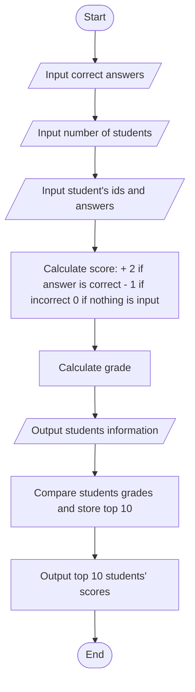

## Test Maker Program
### Description
Your English teacher needs help in grading a True/False, Multiple, and short answers test. The
test answer stored in 1D array and the students’ IDs and test answers are stored in 2D array. The
first entry in the student array contains students’ IDs and other entries in the array are student’s
answers to the question. The exam has 20 questions, and the class has more than 150 students.
Each correct answer is awarded two points, each wrong answer gets one point deducted, and no answer gets zero points. The program processes the test data and should display the student’s ID,
followed by the answers, followed by the test score, followed by the test grade. When it is
required, the program should print the 5/10 top test scores along with the student’s ID in order
the top score first and forth. The program should allow your teacher to search for a student with
his/her id.
### Pseudocode
Step 1: Start  
step 2: Reads input of the correct answers for the twenty multiple choices.  
step 3: Read the number of students, number of student should be greater than 150.  
step 4: Read input students' IDs and answers 
step 5: Calculate scores:  
        if students answer is correct: 2 points is added  
        if students answer is incorrect: 1 point is deducted  
        if student didnt answer: nothing happens  
        total score = score * 2.5  
step 6: Calculate grade:  
        if score is greater than 90: grade is A  
        if score is greater than 80: grade is B  
        if score is greater than 70: grade is C  
        if score is greater than 60: grade is D  
        otherwise: grade is F  
        
step 7: Output User menu for displaying information  
Choose:  
    1 for list of all students' test information  
    2 for a specific student's test information  
    3 for top 10 student's scores 
step 8: Read input using Switch functon based on user choice  
switch choice  
    case 1:  
        Print the list of all student's test information  
        output formatted table with student IDs, test answers, scores, and grades  
        break  
    case 2:  
        Print a specific student's information  
        output "Input Student ID: "  
        input studentID  
        search for studentID in student_answers array and print relevant information  
        break  
    case 3:  
        calculate top 10 scores and corresponding indices  
        sort the top 10 scores and indices  
        Output table with top 10 student IDs and grades  
        break   
    default:  
        output "There's no such choice!"  
step 8: End  

### Flowchart

